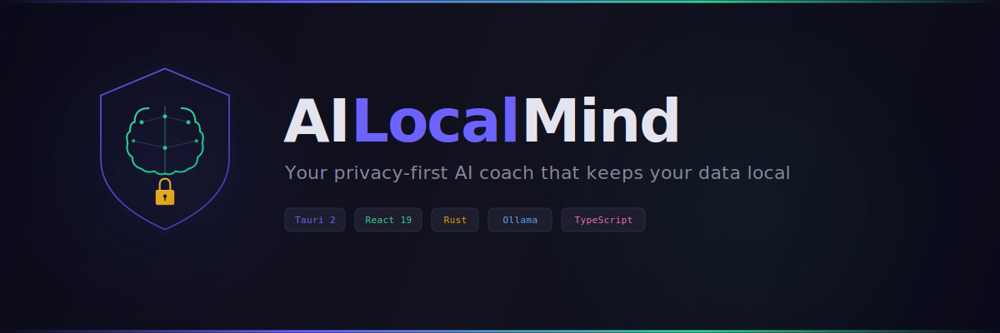
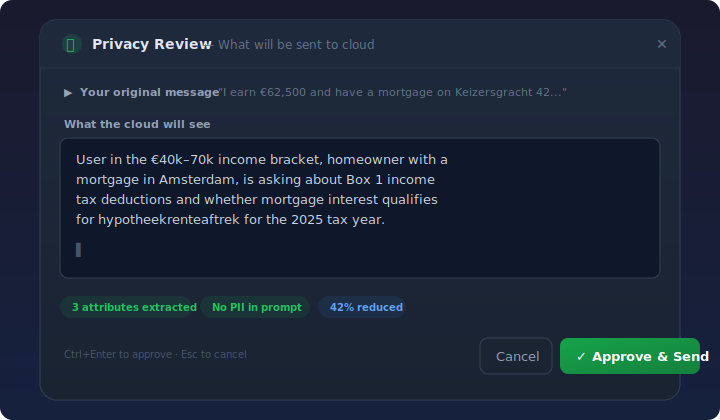

<p align="center">
  
</p>

<p align="center">
  <strong>Your privacy-first AI coach that keeps your data local</strong>
</p>

<p align="center">
  <a href="#-quick-start">Quick Start</a> &nbsp;&bull;&nbsp;
  <a href="#-features">Features</a> &nbsp;&bull;&nbsp;
  <a href="#-how-it-works">How It Works</a> &nbsp;&bull;&nbsp;
  <a href="#-ai-models--providers">AI Models</a> &nbsp;&bull;&nbsp;
  <a href="#-contributing">Contributing</a>
</p>

<p align="center">
  
  
  
  
  
</p>

---

### Why AILocalMind?

AI assistants are becoming part of daily life -- but at what cost to your privacy?

Major AI platforms are now [serving ads inside their chat interfaces](https://openai.com/index/our-approach-to-advertising-and-expanding-access/), using your conversations to target you with personalized advertising. Your tax questions, health concerns, financial plans, career doubts -- all of it feeds an ad engine. Even when providers promise they "don't sell your data," your conversations still live on their servers, subject to policy changes, data breaches, and government requests.

**AILocalMind takes a different approach.** Your data stays on your machine. Period.

- No ads. No profiling. No conversation mining.
- Your tax records, health data, and financial details never leave your device unless you explicitly allow it.
- When cloud AI is needed, only anonymized categorical attributes are sent (e.g., "income bracket: 50k-75k") -- never your actual numbers, names, or documents.
- Enable **Airplane Mode** and everything runs locally. Zero network requests. Zero trust required.

**You shouldn't have to choose between a powerful AI assistant and your right to privacy.**

<br>

> [!WARNING]
> **Privacy Notice:** When using **cloud mode**, your messages (after anonymization) are sent to [Nebius Token Factory](https://tokenfactory.nebius.com). **Zero Data Retention (ZDR) is NOT enabled by default** -- you must manually activate it in your Nebius account profile. Without ZDR, Nebius stores your prompts and outputs to power speculative decoding (performance optimization). With ZDR enabled, your data is never stored and never used for model training. See the [Nebius Account Setup](#nebius-account-setup) section below. For maximum privacy, use **Airplane Mode** (fully local, zero network requests).

<br>

## &#9889; Quick Start

### For users (download the app)

1. Download the latest `.exe` installer from [Releases](https://github.com/your-username/AILocalMind/releases)
2. Install and open AILocalMind
3. Set up your Nebius account ([see instructions below](#nebius-account-setup))
4. Enter your API key and endpoint in AILocalMind Settings
5. Choose a persona and start chatting

> **Want fully offline mode?** Install [Ollama](https://ollama.ai/), run `ollama pull mistral:7b-instruct-q5_K_M` (one-time ~5 GB download), then enable **Airplane Mode** in Settings. No Nebius account needed.

### For developers (build from source)

**Prerequisites:** [Node.js](https://nodejs.org/) 22+, [pnpm](https://pnpm.io/) 10+, [Rust](https://rustup.rs/) 1.75+

```bash
git clone https://github.com/your-username/AILocalMind.git
cd AILocalMind/apps/desktop

pnpm install
cp ../../.env.example ../../.env    # then edit with your API keys

pnpm tauri dev
```

<br>

## &#128736; Features

<table>
<tr>
<td width="50%">

### &#128274; Local PII Encryption
ChaCha20-Poly1305 (256-bit AEAD) encryption for all sensitive data. Keys stored in Windows Credential Manager, never in files.

</td>
<td width="50%">

### &#128101; Multi-Persona System
Tax Navigator, Psychologist, Career Coach -- each persona has independent privacy settings and LLM backend configuration.

</td>
</tr>
<tr>
<td>

### &#9889; Hybrid Cloud Routing
Per-persona choice of **local-only**, **cloud-only**, or **hybrid** (anonymize locally, process in cloud).

</td>
<td>

### &#128260; Re-hydration Templates
Cloud generates responses with `[PLACEHOLDERS]`. Your local system fills in real values -- PII never touches the network.

</td>
</tr>
<tr>
<td>

### &#128065; Prompt Transparency Review
See the exact sanitized prompt before it's sent to cloud. Edit, approve, or cancel -- full control over what leaves your machine.

</td>
<td>

### &#128196; Document Parsing
Ingest PDF and DOCX files with automatic PII detection. Sensitive fields are masked before any processing.

</td>
</tr>
<tr>
<td colspan="2">

### &#127758; Dutch Tax Knowledge
Built-in understanding of Dutch tax concepts: Box 1/2/3, deductions, BSN validation, and more.

</td>
</tr>
</table>

<br>

## &#128736; How It Works

The privacy pipeline ensures your sensitive data never reaches cloud LLMs:

```
                    +-----------------------+
  Your message ---> |  1. Backend Router    |  Decides: local, cloud, or hybrid
                    +-----------------------+
                              |
                              v
                    +-----------------------+
                    |  2. Attribute Extract  |  Extracts categories only:
                    |                       |  income_bracket: "50k-75k"
                    |                       |  employment_type: "employed"
                    +-----------------------+
                              |
                              v
                    +-----------------------+
                    |  3. Prompt Review     |  YOU see the sanitized prompt
                    |     (NEW!)           |  Edit, approve, or cancel
                    +-----------------------+  before anything is sent
                          |           |
                    [Approve]    [Cancel -> stop, nothing sent]
                          |
                          v
                    +-----------------------+
                    |  4. Cloud LLM         |  Sees: "User in 50k-75k bracket,
                    |     (Nebius API)      |   employed, asking about Box 1"
                    +-----------------------+  Returns: "Your [INCOME] falls in..."
                              |
                              v
                    +-----------------------+
                    |  5. Re-hydration      |  Fills [INCOME] -> "62,500"
                    |     (local only)      |  Fills [BSN] -> "123456789"
                    +-----------------------+
                              |
                              v
                      Final response with
                      your real values
```

> **Key principle:** Real PII values **never leave your machine**. The cloud only sees categorical attributes and placeholders.

### Prompt Transparency Review

When using **hybrid** or **attributes-only** personas, AILocalMind pauses before sending anything to the cloud and shows you the exact sanitized prompt in an interactive review panel:

<p align="center">
  
</p>

You can:
- **See** the sanitized prompt the cloud will receive (no PII, only categorical attributes)
- **Edit** the prompt before it's sent -- add context, remove details, refine the question
- **Approve & Send** (or press `Ctrl+Enter`) to send the reviewed prompt to the cloud
- **Cancel** (or press `Esc`) to discard -- **zero data leaves your machine**

<p align="center">
  
</p>

The review panel shows:
- **Your original message** (collapsed by default) -- what you typed
- **What the cloud will see** (editable) -- the sanitized, attribute-only version
- **Privacy badges** -- number of attributes extracted, PII status, reduction percentage

> **When does review trigger?** Only for personas configured with `attributes_only` content mode or `hybrid` backend. Direct cloud and local-only modes skip the review (no cloud exposure to review for local; user chose speed for direct).

### Content Modes

| Mode | What's Sent | Use Case |
|------|-------------|----------|
| `full_text` | Complete message | General chat, no PII detected |
| `attributes_only` | Categorical attributes only | Tax questions with sensitive data |
| `blocked` | Nothing | Requests for raw BSN/IBAN export |

<br>

## &#129302; AI Models & Providers

AILocalMind supports two modes of operation. You can switch between them at any time from the model selector in the chat input area.

### Cloud Mode (default) -- Nebius Token Factory

The default mode uses [Nebius Token Factory](https://tokenfactory.nebius.com) as the cloud LLM provider. **Why Nebius?**

- **Zero Data Retention (opt-in)** -- When enabled, your prompts and outputs are **never stored and never used for model training**
- **SOC 2 Type II, HIPAA, ISO 27001** certified data centers
- **EU & US data residency** -- Data centers in Finland, France, and the US
- **Open-source models only** -- No proprietary black-box models; you know exactly what's running
- **OpenAI-compatible API** -- Standard API format, easy to migrate if needed
- **You retain full ownership** of all input data and generated content

> [!CAUTION]
> **Zero Data Retention is NOT on by default.** Without it, Nebius stores your prompts and outputs to accelerate inference via speculative decoding. If you are using AILocalMind with sensitive data, **you must enable ZDR** in your Nebius account settings before use. See setup instructions below.

#### Nebius Account Setup

1. **Create an account** at [tokenfactory.nebius.com](https://tokenfactory.nebius.com)
   - Sign in with your Google or GitHub account
2. **Enable Zero Data Retention**
   - Go to your **Account Profile** page
   - Find the **Zero Data Retention** toggle and **enable it**
   - Note: This may slightly reduce inference speed (disables speculative decoding) but ensures maximum privacy
3. **Get your API key**
   - Navigate to the API keys section in your account
   - Create a new API key and copy it
   - See [Authentication docs](https://docs.tokenfactory.nebius.com/api-reference/introduction#authentication) for details
4. **Configure AILocalMind**
   - Open AILocalMind Settings
   - Paste your API key in the **Nebius API Key** field
   - Set the **API Endpoint** to:
     ```
     https://api.tokenfactory.nebius.com/v1
     ```
   - Save and you're ready to chat

**Available cloud models:**

| Model | Strengths | Context |
|-------|----------|---------|
| Qwen3 32B Fast | Best balance of speed & quality (default) | 32k |
| DeepSeek V3 | Strong reasoning | 64k |
| Llama 3.1 70B | High quality, large context | 128k |
| Mistral Nemo | Fast, lightweight | 128k |

> [!NOTE]
> Model availability may change as Nebius updates their catalog. Check [Nebius Token Factory](https://tokenfactory.nebius.com) for the latest list.

### Airplane Mode (fully offline) -- Ollama

For maximum privacy, enable **Airplane Mode** in Settings. This routes all AI requests through [Ollama](https://ollama.ai/), running entirely on your machine with **zero network requests**.

**Setup (one-time):**

1. Install [Ollama](https://ollama.ai/) (free, ~100 MB)
2. Open a terminal and download a model:
   ```bash
   ollama pull mistral:7b-instruct-q5_K_M
   ```
3. Enable **Airplane Mode** in AILocalMind Settings

**Recommended local model:**

| Model | Size | RAM needed | Best for |
|-------|------|-----------|----------|
| **Mistral 7B** (default) | ~5 GB | 8 GB+ | General chat, privacy pipeline |

> [!IMPORTANT]
> **Local models are NOT bundled with the app.** You must install Ollama and download models separately. Each model is a 3-8 GB download. The app ships with Mistral 7B as the recommended default because it offers the best balance of quality and resource usage for the privacy/anonymization pipeline.
>
> Advanced users can add more models via `ollama pull <model-name>` -- they will appear automatically in the model selector. See the [Ollama model library](https://ollama.com/library) for options.

### When to use which mode

| Scenario | Recommended Mode |
|----------|-----------------|
| General questions, no sensitive data | Cloud (faster, smarter) |
| Tax questions with personal financial data | Hybrid (anonymize + cloud) |
| Sensitive personal/health topics | Airplane (fully local) |
| No internet connection | Airplane |
| Maximum speed, large documents | Cloud |

<br>

## &#128295; Tech Stack

<table>
<tr>
<td align="center" width="120">
<br>
<br>
<sub><b>Desktop</b></sub>
<br><br>
</td>
<td align="center" width="120">
<br>
<br>
<sub><b>Frontend</b></sub>
<br><br>
</td>
<td align="center" width="120">
<br>
<br>
<sub><b>Backend</b></sub>
<br><br>
</td>
<td align="center" width="120">
<br>
<br>
<sub><b>Language</b></sub>
<br><br>
</td>
<td align="center" width="120">
<br>
<br>
<sub><b>Styling</b></sub>
<br><br>
</td>
</tr>
</table>

| Layer | Technology | Purpose |
|-------|-----------|---------|
| Desktop Shell | **Tauri 2** | Native window, IPC, system integration |
| Frontend | **React 19** + TypeScript | Chat UI, persona config, privacy controls |
| Backend | **Rust** | Encryption, PII processing, Ollama client |
| State | **Zustand** + **Dexie** (IndexedDB) | App state, persistent chat history |
| Styling | **TailwindCSS v4** | Utility-first responsive design |
| AI (cloud) | **Nebius AI Studio** | Cloud inference (zero data retention) |
| AI (local) | **Ollama** | On-device inference (requires separate install) |
| Voice | **LiveKit** | Real-time voice interaction |
| Encryption | **ChaCha20-Poly1305** | AEAD encryption for all PII |

<br>

## &#128193; Project Structure

```
apps/desktop/
  src/                         # React frontend
    components/
      chat/                    #   Chat window, message bubbles, prompt review, sidebar
      personas/                #   Persona config, LLM backend editor
      privacy/                 #   PII profile editor, privacy status
      settings/                #   App & privacy settings
    hooks/                     #   useChat, usePrivacyChat, useVoice
    services/                  #   TypeScript service layer
    stores/                    #   Zustand (chat, settings, personas, profiles)
    types/                     #   TypeScript type definitions
  src-tauri/                   # Rust backend
    src/
      lib.rs                   #   Tauri app setup & command registration
      db.rs                    #   SQLite database
      crypto.rs                #   ChaCha20-Poly1305 encryption
      ollama.rs                #   Ollama HTTP client
      anonymization.rs         #   PII detection & replacement
      attribute_extraction.rs  #   Categorical attribute extraction
      rehydration.rs           #   Template filling with real values
      backend_routing.rs       #   Per-persona backend selection
      profiles.rs              #   User profile management
      tax_knowledge.rs         #   Dutch tax domain knowledge
website/                       # Netlify landing page
```

<br>

## &#129309; Contributing

Contributions are welcome! Here's how to get started:

1. **Fork** the repository
2. **Create** a feature branch: `git checkout -b feature/amazing-feature`
3. **Code** your changes
4. **Test**: `cd apps/desktop/src-tauri && cargo test`
5. **Commit** and **push**
6. Open a **Pull Request**

<br>

## &#128220; License

This project is licensed under the [MIT License](LICENSE).

---

<p align="center">
  <sub>Built with &#128156; for people who care about their privacy</sub>
</p>
